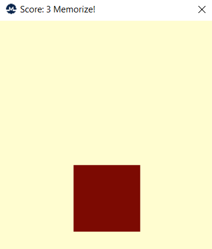

# Memory Game (WinAPI)

## Description
This project is a simple memory game implemented using Windows API (WinAPI). The game displays an NxN grid of square fields (each being a separate window). The player must memorize and repeat the sequence in which the fields light up. With each successful repetition, the sequence extends by one additional step. The game tracks the player's best score, which is the longest correctly repeated sequence.

## Screenshot
<p align="center">
  
</p>

## Features
- Grid-based memory game using WinAPI.
- Configurable grid size (N x N, where N is between 3 and 10).
- Random sequence generation for each game session.
- Player interaction through mouse clicks.
- Score tracking to monitor the best performance.
- Responsive UI updates and animations.

## Installation and Usage
### Prerequisites
- Windows OS (required for WinAPI support)
- A C++ compiler that supports WinAPI (e.g., MinGW, MSVC)

### Compilation
To compile the project, use a suitable compiler:
```sh
cl /EHsc /D_UNICODE /DUNICODE /O2 app.cpp board.cpp main.cpp /link /SUBSYSTEM:WINDOWS
```

### Running the Game
The game can be launched with an optional command-line argument specifying the grid size:
```sh
MemoryGame.exe [N]
```
Where `N` is the grid size (between 3 and 10). If omitted, the default size is `3`.

### Example
```sh
MemoryGame.exe 5
```
This starts the game with a 5x5 grid.

## How to Play
1. The game starts by displaying a sequence of highlighted fields.
2. Memorize the sequence and click the fields in the correct order.
3. If successful, the sequence extends by one additional step.
4. If a mistake is made, the game ends and displays the best score.
5. Press `ESC` to restart the game.


## License
This project is released under the MIT License.

## Author
Developed by Svetlana Gridina

